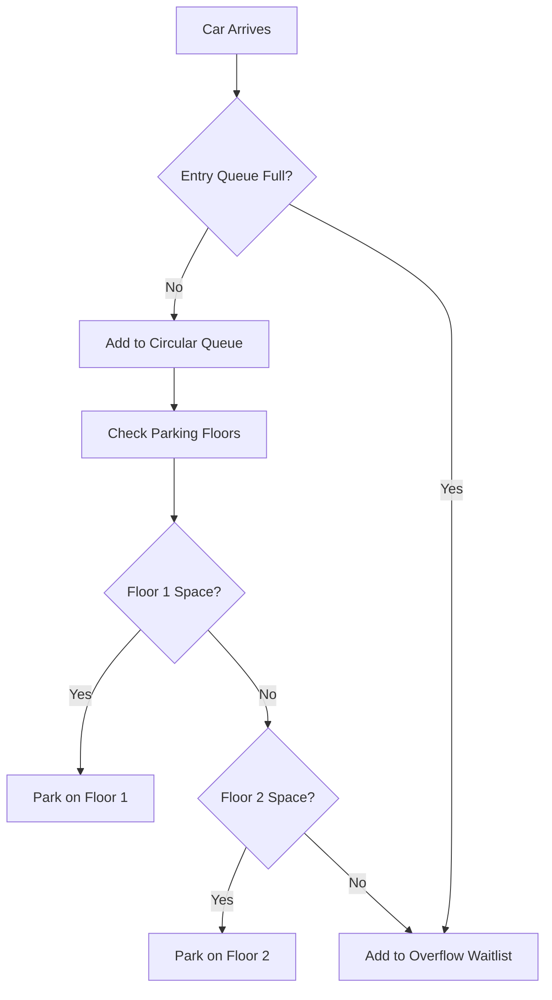

# 🚗 Car Parking Management System

A robust, console-based **Car Parking Management System** developed in C++. This project demonstrates the practical implementation of core Data Structures and Algorithms (DSA) to solve real-world resource allocation problems.

## 📌 Project Overview

This system simulates a multi-floor parking facility. It efficiently manages car inflow and outflow using a combination of linear and non-linear data structures. The system handles congestion by utilizing an entry queue and an overflow waitlist, ensuring a seamless user experience.

### 🛠 Key Features

- **Multi-Floor Support**: Manages parking across multiple levels using a Stack-based LIFO approach.
- **Entry Queue Management**: Uses a **Circular Queue** to handle incoming cars before they are assigned a slot.
- **Congestion Handling**: Implements a **Linked List-based Waitlist** for overflow when the parking lot and entry queue are both full.
- **Real-time Tracking**: Dynamically tracks car positions and floor assignments.
- **Interactive CLI**: A user-friendly menu-driven interface for all operations.

---

## 🏗 System Architecture & Data Structures

The project leverages specific data structures to mimic real-world parking logic:

| Component | Data Structure | Why? |
| :--- | :--- | :--- |
| **Parking Floor** | `Stack` | Simulates LIFO (Last-In-First-Out) parking where the last car in is the first one out. |
| **Entry Queue** | `Circular Queue` | Efficiently manages a fixed-size buffer for incoming vehicles. |
| **Overflow Waitlist** | `Singly Linked List` | Provides dynamic scaling for an unlimited number of waiting cars during peak hours. |
| **Parking Records** | `Dynamic Array` | Stores real-time coordinate data (Floor, Position) for each vehicle. |

### 📊 Logic Flow



---

## 🚀 Getting Started

### Prerequisites

- A C++ compiler (GCC/G++, Clang, or MSVC).

### Compilation & Execution

1. **Clone the repository**:
   ```bash
   git clone https://github.com/Hasaan901/dsa-car-parking.git
   cd dsa-car-parking
   ```

2. **Compile the source code**:
   ```bash
   g++ main.cpp -o parking_system
   ```

3. **Run the application**:
   ```bash
   ./parking_system
   ```

---

## 💻 Sample Interaction

```text
Parking Lot Menu:
1. Enter car (Add to entry queue or overflow waitlist)
2. Park car from queue
3. Remove car from floor
4. Display parking lot, queues, and waitlist
5. Exit

Enter your choice: 1
Enter car number to add: 101
Car 101 added to the entry queue.

Enter your choice: 2
Car 101 parked on Floor 1, Position 1.
```

---

## 👨‍💻 Developer Information

- **Name**: Hasaan Ahmed
- **Target Course**: Data Structures & Algorithms
- **Institution**: University Project

---

## 📜 License

This project is licensed under the **MIT License** - see the [LICENSE](LICENSE) file for details.

---

> [!NOTE]  
> This project was developed as a university assignment to demonstrate proficiency in C++ and fundamental data structures.

---

[](https://opensource.org/licenses/MIT)
[](https://isocpp.org/)
